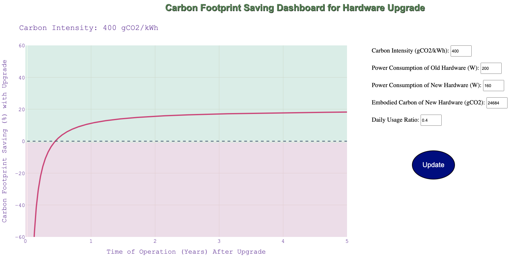

# Toward Sustainable HPC: Carbon Footprint Estimation and Environmental Implications of HPC Systems

Paper at 2023 ACM/IEEE The International Conference for High Performance Computing, Networking, Storage, and Analysis (SC'23)

## Citation

```
@inproceedings{li2023toward,
  title={Toward Sustainable HPC: Carbon Footprint Estimation and Environmental Implications of HPC Systems},
  author={Li, Baolin and Basu Roy, Rohan and Wang, Daniel and Samsi, Siddharth and Gadepally, Vijay and Tiwari, Devesh},
  booktitle={Proceedings of the International Conference for High Performance Computing, Networking, Storage and Analysis},
  pages={1--15},
  year={2023}
}
```

## Benchmarks

We set up three sets of benchmarks to evaluate the carbon and performance on three different application scenarios: CV, NLP, and HPC. These benchmarks are made available in these repositories:

- Computer Vision: [CV](https://github.com/boringlee24/examples)
- Natural Language Processing: [NLP](https://github.com/boringlee24/transformers)
- High Performance Computing: [CANDLE](https://github.com/boringlee24/candle_benchmarks)

The data used to generate the performance and operation carbon results are collected from running these benchmarks.

## Result Visualization

### Environment setup

To visualize the results presented in the paper, on a Linux CPU machine, install the necessary Python packages

```
pip install -r requirements.txt
```

### Combined Carbon Tradeoff in Hardware Upgrade

```
cd combined_carbon
```

The visualization of hardware upgrade impact on carbon saving are in ``part1.ipynb`` and ``part2.ipynb``

#### Dashboard

We create a web dashboard to allow users to interactively explore the embodied carbon and operational carbon tradeoffs. To run the dashboard, execute
```
python dashboard.py
```
The dashboard is available at http://127.0.0.1:8080/

The user can provide their measurements on the old and new hardware, and the dashboard will show the carbon saving over time from the hardware upgrade. Here is what the dashboard looks like:



### HPC Embodied Carbon

```
cd ../embodied_carbon
```

The embodied carbon data per HPC component is collected in ``csv/embodied_carbon_by_component.csv``. The embodied carbon is modeled using [ACT](https://github.com/facebookresearch/ACT). The packaging overhead of Seagate SSD/HDDs are modeled using public sustainablity ([Seagate Sustainability](https://www.seagate.com/esg/planet/product-sustainability/)). More details of the embodied carbon modeling process are available in ``csv/embodied_carbon_modeling.xlsx``

The number of devices of individual components from supercomputers are obtained from public resources:

[LUMI](https://events.it4i.cz/event/160/attachments/457/1717/lumi-intro.pdf)
[Perlmutter](https://docs.nersc.gov/systems/perlmutter/architecture/)
[Frontier](https://olcf.ornl.gov/wp-content/uploads/Frontiers-Architecture-Frontier-Training-Series-final.pdf)

The visualization scripts are provided in ``figure_<topic>.ipynb`` files. For example, ``figure_embodied.ipynb`` shows the visualization of embodied carbon of individual components.

### Regional Operational Carbon

```
cd ../regional_operational_carbon
```

The regional carbon intensity data are collected in the ``csv`` directory. The ``regional_carbon.ipynb`` notebook shows the visualization of regional carbon intensities.

## Contact

Baolin Li: https://baolin-li.netlify.app/

## Carbon-Aware Scheduler

In addition to the characterization and analysis, we also designed a carbon-aware schduler named Clover: [Code](https://github.com/boringlee24/sc23-clover), [Paper](https://dl.acm.org/doi/abs/10.1145/3581784.3607034)

## Call for contribution

We welcome contributions to this repository, especially additional embodied carbon data for different components in addition to our embodied carbon data in [embodied_carbon_by_component.csv](embodied_carbon/csv/embodied_carbon_by_component.csv). 
